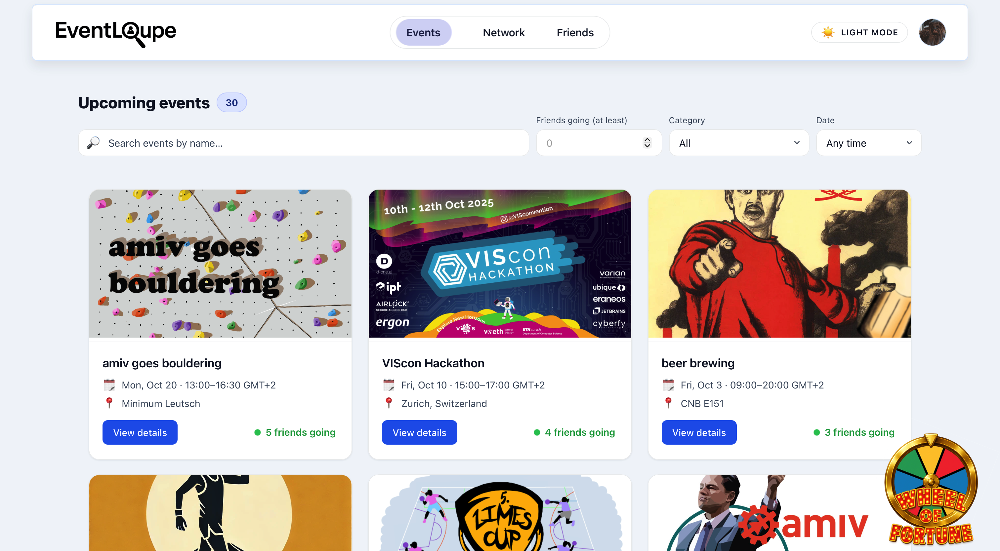

# EventLoupe (Viscon Hackathon 2025)

> Social event discovery with friend-powered context and recommendations.

EventLoupe is a full‑stack app that helps users browse upcoming events, see which friends are attending, and get personalized suggestions. It includes:

- A FastAPI backend with SQLite, SQLAlchemy, Alembic migrations, and a small uploads service.
- A React 19 + Vite frontend written in TypeScript.
- Docker Compose with Traefik routing the frontend, API, and uploads behind a single port.


## Features

- Browse upcoming events with time, location, poster, and category metadata.
- Friend context on events: see friends attending; add/remove friendships.
- RSVP actions: join/leave events; query “am I attending?” per event.
- User profile: visibility controls, names, and profile picture updates.
- Recommendations API: graph‑based scoring of events and edges (topics, social, time).
- Image uploads: simple disk storage served under `/uploads`.
- Demo data: seed scripts and optional scrapers for event sources.


## Screenshots




## Quick Start (Docker)

1) Copy and adjust environment
```bash
cp .env.example .env
```

2) Start everything
```bash
docker compose up --build
```

3) Open the app
- Frontend: http://localhost:8080
- Backend (OpenAPI): http://localhost:8080/api/docs

Docker Compose starts three services: `frontend` (Nginx), `backend` (FastAPI), and `traefik` (reverse proxy on port 8080). Persistent volumes store the SQLite DB and uploaded files.


## Local Development

### Backend (FastAPI)
```bash
cd backend
python -m venv .venv
source .venv/bin/activate
pip install -r requirements.txt

# Optional: align DB + run migrations
make db-upgrade

# Seed demo data (optional)
make db-seed

# Start the API
python app.py  # http://localhost:8000/api/docs
```

Useful make targets (run inside `backend/`):
```
make install    # pip install -r requirements.txt
make db-upgrade # auto-align DB + alembic upgrade head
make db-seed    # insert demo users/events/friendships/attendance
make db-test    # lightweight DB smoke test
make run-debug  # starts API with optional /api/debug endpoints
```

Auth headers: In production behind a proxy, requests include `X-User-Id` and `X-User-Name`. For local development, `USE_MOCK_AUTHENTICATION=true` in `.env` lets the backend assume a developer user if headers are missing.

### Frontend (Vite + React)
```bash
cd frontend
npm install
npm run dev        # http://localhost:5173
```
During development, Vite proxies API and uploads to the backend (see `frontend/vite.config.ts`). In Docker, everything is served via Traefik at port 8080.


## Configuration

Copy `.env.example` to `.env` and adjust. Key variables:

- `USE_MOCK_AUTHENTICATION`: if `true`, falls back to a dev user when proxy headers are absent.
- `ENABLE_DB_DEBUG_ROUTES`: enables `/api/debug/*` endpoints for local inspection.
- `AUTO_SEED` / `AUTO_SCRAPE_EVENTS`: used by the container entrypoint to seed or scrape on startup.
- `MAX_UPLOAD_SIZE_MIB`: upload size limit for the uploads API.
- `VITE_API_BASE_URL`: leave empty for same‑origin; set to override API base in the frontend.

Default SQLite location is `backend/var/data/app.db` (or `/app/var/data/app.db` in the container). Alembic config is in `backend/alembic.ini`.


## API Overview

OpenAPI: `/api/docs` (JSON at `/api/openapi.json`). Core endpoints:

- User
  - `GET /api/user` → current user
  - `PATCH /api/user` → update `first_name`, `last_name`, `visibility_mode`
  - `PATCH /api/user/profile-picture` → set `profile_picture_url`
  - `GET /api/user/stats` → `{ friends_count, events_attended_count }`

- Friends
  - `GET /api/friends` → list friends
  - `PUT /api/friends/{friend_id}` → add friendship (idempotent)
  - `DELETE /api/friends/{friend_id}` → remove friendship

- Blocked
  - `GET /api/blocked` → list blocked users
  - `PUT /api/blocked/{target_id}` → block
  - `DELETE /api/blocked/{target_id}` → unblock

- Events
  - `GET /api/events` → upcoming events with friend context & attendee counts
  - `GET /api/events/registered` → events the current user registered for
  - `GET /api/events/{user_id}/attended` → events a user attended (historical)
  - `POST /api/events/{event_id}/attendees` → RSVP/join
  - `DELETE /api/events/{event_id}/attendees` → un‑RSVP/leave
  - `GET /api/events/{event_id}/attendees/me` → `{ attending, rsvp_status }`

- Search
  - `GET /api/users/search?q=…&limit=20&offset=0` → users by name/username

- Graph (recommendations)
  - `GET /api/graph/recommendations?user_id={id}&debug=false` → returns nodes, edges, scores, explanations

- Uploads
  - `POST /api/uploads?scope=user|event&owner_id={id}` with multipart `file`
  - Files are served from `/uploads/{scope}/{owner_id}/{filename}`

Headers
- `X-User-Id`: required in production; identifies the caller.
- `X-User-Name`: optional; used to initialize a user record (first/last name).


## Data Model (SQLite + SQLAlchemy)

Tables:
- `users`: profile and visibility (`ghost|friends|all`), admin flags, timestamps
- `friendships`: undirected pair `(user_id < friend_id)`, `status=pending|accepted|blocked`
- `events`: schedule, location, poster, `(source, external_id)` unique key
- `event_attendance`: RSVP per user/event with optional `visibility_override`
- `event_tags`: freeform tags per event

Notable constraints/indexes:
- Friendships enforce ordering and valid requester; unique on `(user_id, friend_id)`
- Events unique on `(source, external_id)`; indexes on `starts_at`, `category`, etc.
- Attendance unique on `(user_id, event_id)`


## Seed Data and Scrapers

Seed JSON lives under `backend/db/seed_data/` and can be imported with `make db-seed`. The container entrypoint supports:

- `AUTO_SCRAPE_EVENTS=true`: run scrapers to fetch events and posters (output to `var/seed_data` and `var/uploads`)
- `AUTO_SEED=true`: import JSON after migrations

Scraper utilities (for local use) live under `backend/scripts/old/` and require packages from `backend/scripts/requirements-scraper.txt`.


## Project Structure

```
backend/
  app.py                 # FastAPI app (routes + router mounting)
  models.py              # Pydantic response models
  uploads.py             # Upload API and static serving
  graph_api.py           # Recommendations API (graph-based)
  requirements.txt
  Makefile               # DB + run helpers
  alembic.ini            # Alembic config (SQLite by default)
  db/
    base.py              # Engine/sessions/PRAGMAs
    models.py            # SQLAlchemy ORM models
    migrations/          # Alembic migrations
    seed.py              # Seed data from JSON
    deps.py              # FastAPI DB dependencies + auth resolution
    repositories.py      # Query helpers
    debug_routes.py      # Optional /api/debug endpoints

frontend/
  src/                   # React + TS app
  vite.config.ts         # Dev server + API proxy config
  Dockerfile             # Nginx build for static hosting

docker-compose.yml       # Traefik + services wiring
.env.example             # Configuration template
```


## Security & Privacy Notes

- No secrets are committed; configure runtime values via `.env`.
- Debug endpoints are disabled by default; enable only for local debugging.
- CORS is permissive in development; restrict `allow_origins` for production.
- Uploaded files are served from `var/uploads` and not scanned—treat as untrusted content.
